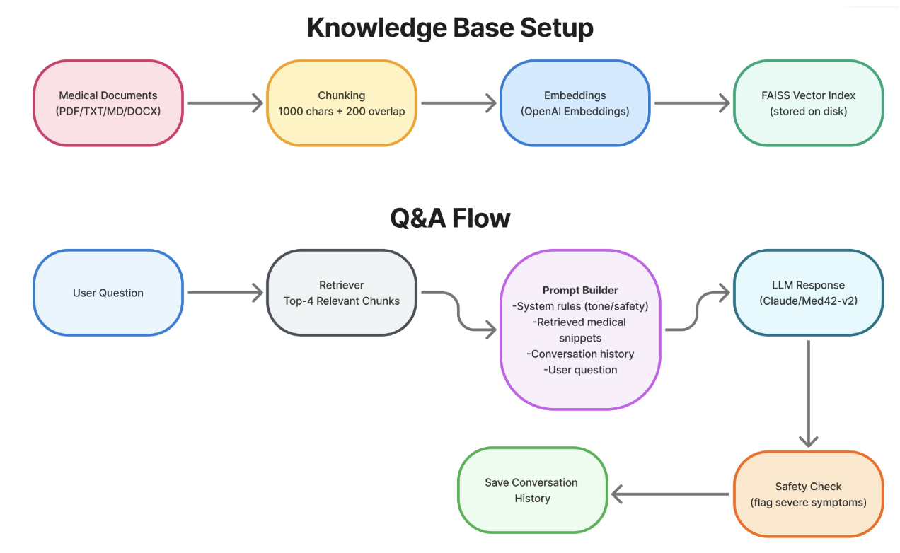
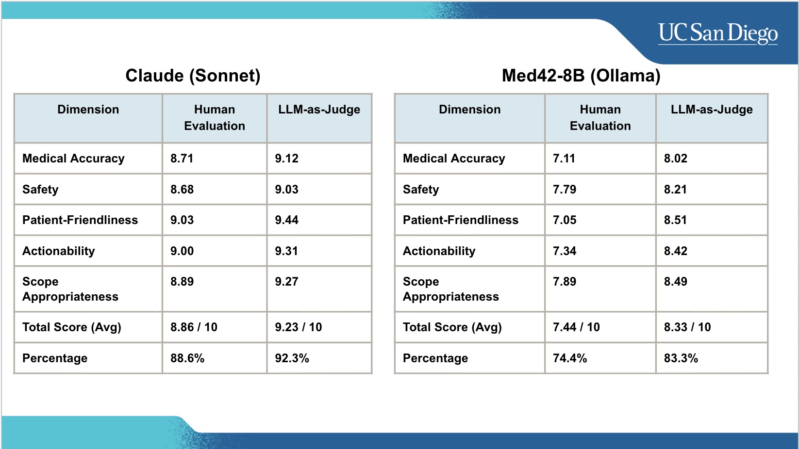
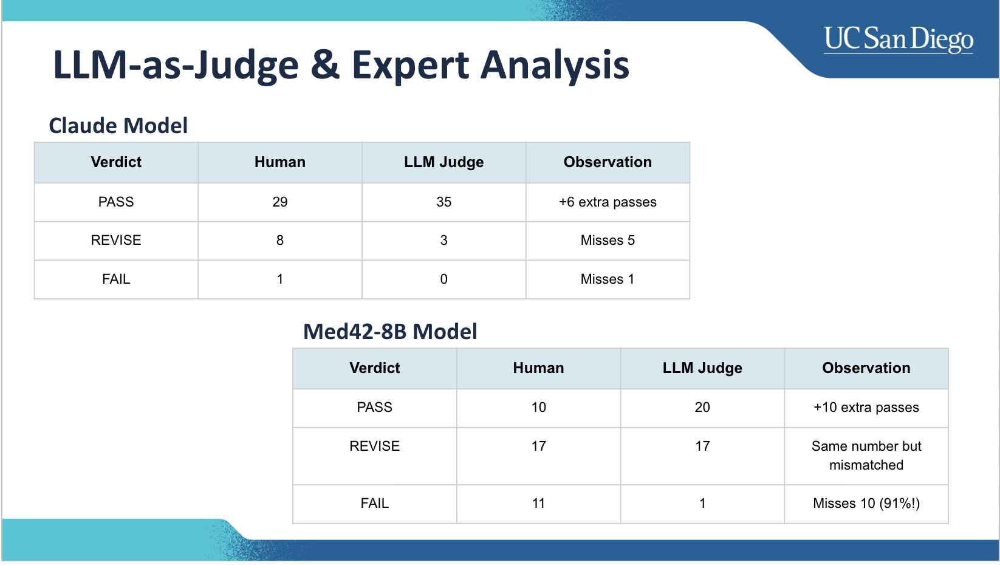
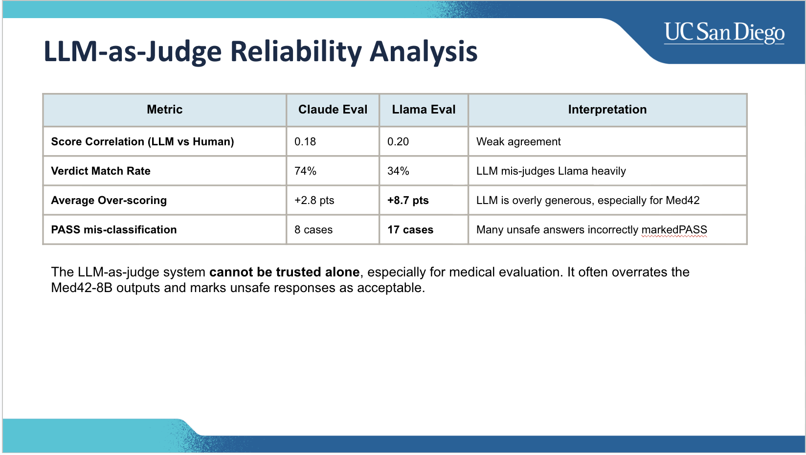

## Patient RAG Chatbot: Hemorrhoids & Constipation

A patient-friendly RAG chatbot focused on hemorrhoids and constipation. It provides empathetic guidance, detects red flags, and grounds answers in trusted medical sources (ACG, ASCRS, AGA). The system includes persistent conversation memory and a rigorous evaluation pipeline (LLM-as-judge + human/doctor review).



### Key Features
- Patient-centered responses with safety-first behavior and red-flag escalation
- Retrieval-Augmented Generation (RAG) over curated medical documents
- Persistent conversation memory across sessions
- Evaluation framework with both LLM-as-judge and human/doctor review
- Local FAISS vectorstore; documents live in `documents/`

### Tech Stack
- LLM: Claude (primary); Med42-8B via Ollama for comparison
- RAG: LangChain + FAISS + OpenAI embeddings
- Evaluation: Custom test runner, LLM-as-judge (Claude), optional human/doctor scoring

---

## Getting Started

### 1) Install dependencies
```bash
pip install -r requirements.txt
```

### 2) Environment variables
Create a `.env` file in the project root:
```
ANTHROPIC_API_KEY=your_anthropic_key
OPENAI_API_KEY=your_openai_key               # for embeddings
# Optional patient context via Supabase
SUPABASE_URL=...
SUPABASE_ANON_KEY=...
HEMS_USER_ID=...                              # optional demo patient ID
```

### 3) Prepare documents and build the vectorstore
Add PDFs/TXT/MD/CSV/HTML to `documents/`, then run:
```bash
python rag_setup.py
```
This creates `faiss_index/` used at runtime.

### 4) Run the chatbot
```bash
python patient_chatbot.py
```
- If the vectorstore is missing, run `rag_setup.py` first.

---

## Project Architecture
High-level flow:
1. User asks a question
2. Retriever fetches relevant chunks from FAISS
3. Prompt composes: system safety policy + patient context + retrieved medical context + chat history
4. LLM generates response (Claude by default)
5. Red-flag post-processor appends urgent guidance if needed

See `images/architecture.png` (add your diagram there).

---

## Evaluation Methodology

### Models Compared
- Claude (RAG): primary production configuration
- Med42-8B (Ollama, RAG): baseline comparison

### Datasets
- Curated test cases covering: common queries, red flags, edge cases, emotional support, follow-ups, myths, pregnancy safety
- Optional forum-derived cases (see `testing_framework.py` web scraping utilities)

### LLM-as-Judge (Automated)
- Implemented in `testing_framework.py::LLMJudgeEvaluator`
- Uses Claude with a structured rubric across five dimensions:
  - Medical Accuracy, Safety & Red Flags, Patient-Friendliness, Actionability, Scope
- Produces JSON with dimension scores, overall percentage, and PASS/REVISE/FAIL
- Strength: fast, scalable early signal
- Limitation: tends to overestimate weaker models and can miss subtle safety/clarity failures; not a replacement for human review

### Human/Doctor Review
- Implemented in `testing_framework.py::HumanEvaluationInterface`
- Clinician evaluates a subset for:
  - Medical accuracy/safety
  - Clarity and actionability
  - Appropriateness of scope and empathy
- Considered the source of truth when disagreeing with LLM-as-judge

### How to Re-run the Evaluation
```bash
python test_runner.py
```
Follow the prompts to:
- Generate responses
- Run LLM-as-judge
- Optionally run human evaluation and save results to `test_results/`

---

## Results Summary





Key findings:
- Claude (RAG) consistently outperforms Med42-8B across all evaluation dimensions.
- The performance gap is large, meaningful, and statistically significant.
- Claude delivers clearer, more accurate, and more actionable medical advice.
- Med42-8B produces too many unclear, incomplete, or unsafe responses.
- Claude shows far higher pass rates and more stable behavior across test cases.
- Med42-8B frequently misses red flags and struggles with condition identification.
- LLM-as-judge regularly overestimates Med42-8B’s quality and misses failures.
- Automated judging can support quick screening but cannot replace human review.

---

## Repository Guide
- `patient_chatbot.py`: main chat loop; safety logic and RAG chain
- `conversation_memory.py`: lightweight persistent memory
- `rag_setup.py`: document ingestion and FAISS vectorstore creation
- `testing_framework.py`: web scraping utilities, LLM-as-judge, human evaluator
- `test_runner.py`: end-to-end generation + evaluation orchestrator
- `documents/`: source medical material (guidelines, patient center)
- `faiss_index/`: persisted vectorstore (generated)
- `test_data/` and `test_results/`: inputs and outputs for evaluation
- `integrations/supabase_utils.py`: optional patient context integration

## Notes
- We previously explored LoRA fine-tuning but did not use it in this repo; the `lora_finetune/` folder has been removed to keep the project focused on RAG with Claude and Med42-8B comparisons.
